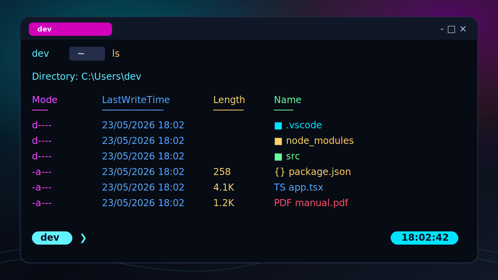
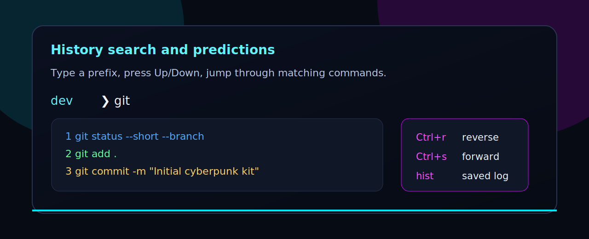
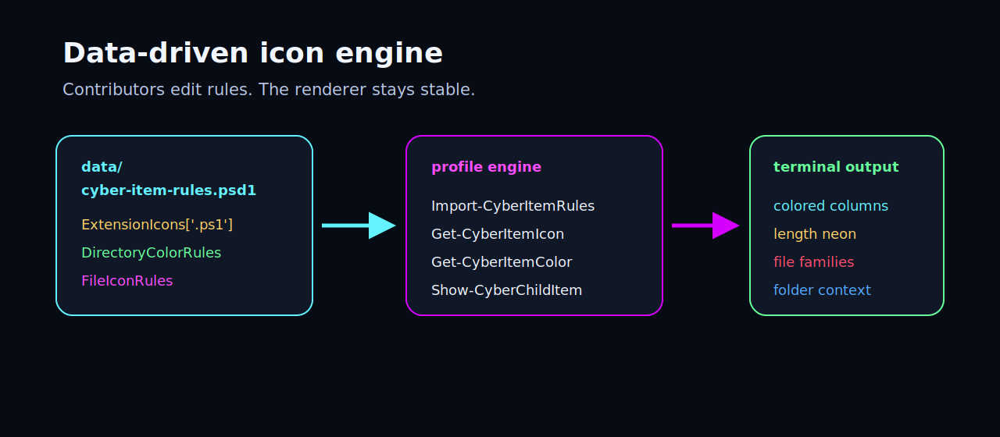
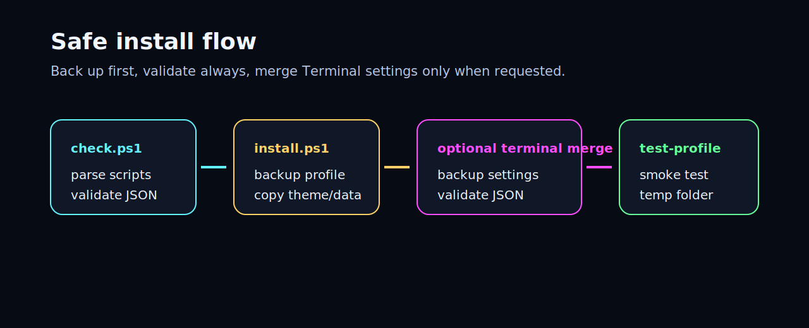
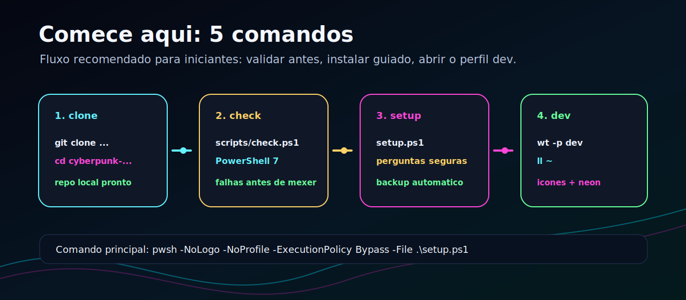
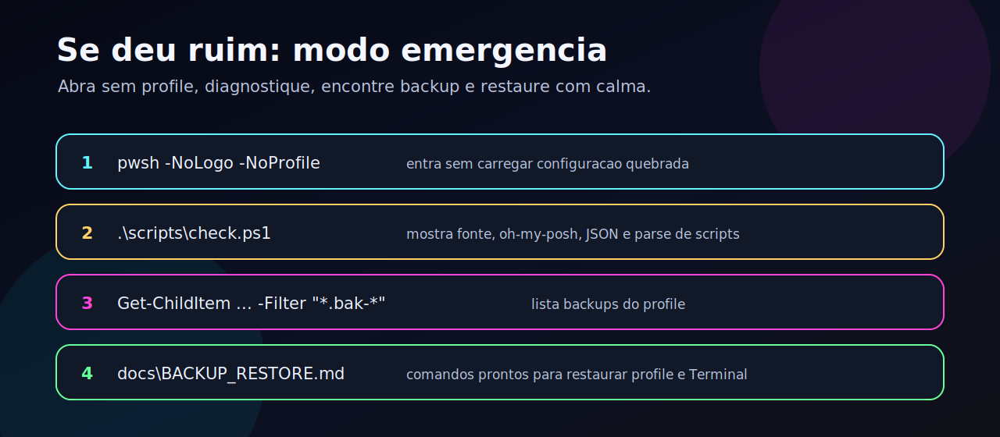

# Cyberpunk PowerShell Terminal

Language: [Português do Brasil](README.md) | English



A portable Windows Terminal + PowerShell 7 setup with a cyberpunk visual style,
fast history search, an oh-my-posh prompt, and a custom `ls` renderer powered by
Nerd Font icons and neon RGB colors.

This project started as a real daily-driver terminal setup and was cleaned up
into a reproducible kit that other people can inspect, install, customize, and
contribute to safely.

[](https://github.com/bieltrue95/cyberpunk-pwsh-terminal/actions/workflows/ci.yml)


## Start Here

If you just want to install without reading everything first, use the guided
setup:

```powershell
git clone git@github.com:bieltrue95/cyberpunk-pwsh-terminal.git
cd cyberpunk-pwsh-terminal
pwsh -NoLogo -NoProfile -File .\scripts\check.ps1
pwsh -NoLogo -NoProfile -ExecutionPolicy Bypass -File .\setup.ps1
wt -p dev
```

No GitHub SSH key yet? Use HTTPS:

```powershell
git clone https://github.com/bieltrue95/cyberpunk-pwsh-terminal.git
```

Beginner guide: [docs/en/GETTING_STARTED.md](docs/en/GETTING_STARTED.md).

## If Something Breaks

Open a shell without loading the profile and run diagnostics:

```powershell
pwsh -NoLogo -NoProfile
cd cyberpunk-pwsh-terminal
.\scripts\check.ps1
```

Backup locations and restore commands are documented in
[docs/en/BACKUP_RESTORE.md](docs/en/BACKUP_RESTORE.md).

## Preview Gallery

| Terminal renderer | History search |
| --- | --- |
|  |  |

| Data-driven rules | Safe installer |
| --- | --- |
|  |  |

| Quick start | Emergency mode |
| --- | --- |
|  |  |

The previews are committed as SVG files so the README renders nicely on GitHub
without external image hosting. Real PNG screenshots can be added later in the
same `screenshots/` folder.

## What You Get

- PowerShell 7 profile focused on developer workflow.
- Persistent PSReadLine history with prefix search on `UpArrow` and `DownArrow`.
- `hist` and `hfind` helpers for searching saved command history.
- Custom `ls`, `dir`, `l`, and `ll` renderer with icon-aware, colorized output.
- Data-driven icon/color rules in `data/cyber-item-rules.psd1`.
- Broad coverage for Windows folders, user folders, dev tools, cloud folders,
  Office files, certificates, media, archives, databases, and common languages.
- Minimal cyberpunk oh-my-posh prompt theme.
- Windows Terminal `dev` profile snippet and `Cyberpunk2026` color scheme.
- Guided setup (`setup.ps1`) with prompts and validation.
- Safe installer that backs up existing files before replacing anything.
- Optional Windows Terminal merge with backup and JSON validation.
- Diagnostics and smoke tests that are also used by GitHub Actions.

## Prerequisites

Install or verify these before applying the profile:

| Requirement | Why it matters | Required |
| --- | --- | --- |
| Windows 10/11 | Target platform for this setup. | Yes |
| PowerShell 7 (`pwsh`) | The profile is designed for modern PowerShell, not Windows PowerShell 5.1. | Yes |
| Git | Needed to clone/update the repository. | Yes for repo install |
| Windows Terminal | Needed for the `Cyberpunk2026` scheme, acrylic, tab styling, and proper ANSI colors. | Recommended |
| FiraCode Nerd Font Mono | Required for folder/file icons and prompt glyphs to render correctly. | Yes for icons |
| oh-my-posh | Provides the styled prompt. | Recommended |

Quick verification:

```powershell
pwsh --version
git --version
wt --version
oh-my-posh --version
```

The profile still works without oh-my-posh, but the styled prompt only loads
when `oh-my-posh` is installed and available in `PATH`.

Install common dependencies with `winget`:

```powershell
winget install Microsoft.PowerShell
winget install Git.Git
winget install Microsoft.WindowsTerminal
winget install JanDeDobbeleer.OhMyPosh -s winget
```

Install `FiraCode Nerd Font Mono` from Nerd Fonts, then select it in Windows
Terminal. If icons show as boxes, the font is missing or the terminal profile is
using another font.

## Manual Quick Start

Clone the repo:

```powershell
git clone git@github.com:bieltrue95/cyberpunk-pwsh-terminal.git
cd cyberpunk-pwsh-terminal
```

Run diagnostics before installing:

```powershell
pwsh -NoLogo -NoProfile -File .\scripts\check.ps1
```

Install with the guided setup:

```powershell
pwsh -NoLogo -NoProfile -ExecutionPolicy Bypass -File .\setup.ps1
```

Or manually install only the profile, theme, and rule data:

```powershell
.\install.ps1
```

Reload the current shell or open a new Windows Terminal tab:

```powershell
. $PROFILE
```

## Optional Install Modes

Install oh-my-posh with `winget` when missing:

```powershell
.\install.ps1 -InstallOhMyPosh
```

Merge the Windows Terminal profile and color scheme automatically:

```powershell
.\install.ps1 -ConfigureWindowsTerminal
```

Use a custom Windows Terminal settings path:

```powershell
.\install.ps1 -ConfigureWindowsTerminal -TerminalSettingsPath "C:\path\to\settings.json"
```

The Terminal merge is opt-in. It creates a timestamped backup and validates JSON
before writing anything.

## Backups And Restore

The installer saves backups next to the original files.

| Backup | Where it lives | Format |
| --- | --- | --- |
| Previous profile | Same folder as `$PROFILE` | `Microsoft.PowerShell_profile.ps1.bak-yyyyMMdd-HHmmss` |
| Uninstall backup | Same folder as `$PROFILE` | `Microsoft.PowerShell_profile.ps1.backup-before-uninstall-yyyyMMdd-HHmmss` |
| Windows Terminal | Same folder as `settings.json` | `settings.json.bak-yyyyMMdd-HHmmss` |

Installed files usually live in:

```text
C:\Users\<you>\Documents\PowerShell\Microsoft.PowerShell_profile.ps1
C:\Users\<you>\Documents\PowerShell\themes\cyberpunk-clean.omp.json
C:\Users\<you>\Documents\PowerShell\data\cyber-item-rules.psd1
```

For the complete backup, listing, and restore guide, see
[docs/en/BACKUP_RESTORE.md](docs/en/BACKUP_RESTORE.md).

## Daily Commands

```powershell
ls
ll
hist -Last 20
hist -Search git
hfind docker
ccurl --version
```

## How The Icon Engine Works

The renderer is intentionally split into logic and data.

```text
data\cyber-item-rules.psd1       # icon/color rules
profile\Microsoft.PowerShell_profile.ps1  # rule engine and renderer
```

The profile loads `data/cyber-item-rules.psd1`, then resolves each item in this
order:

1. Link fallback.
2. Directory regex rules.
3. File-name regex rules.
4. Extension maps.
5. Default folder/file fallback.

This keeps contributions simple: most new icon requests only touch the data
file, not the PowerShell renderer.

## Customize Icons And Colors

Edit:

```text
data\cyber-item-rules.psd1
```

Example:

```powershell
ExtensionIcons = @{
    '.ps1' = '󰨊'
    '.json' = ''
}

ExtensionColors = @{
    '.ps1' = '#63F3FF'
    '.json' = '#FFD166'
}
```

Main sections:

- `DirectoryIconRules`: regex rules for folder icons.
- `FileIconRules`: regex rules for file-name icons.
- `ExtensionIcons`: extension-to-icon map.
- `DirectoryColorRules`: regex rules for folder colors.
- `FileColorRules`: regex rules for file-name colors.
- `ExtensionColors`: extension-to-color map.

Keep the file saved as UTF-8 because Nerd Font glyphs are stored directly in it.

## Windows Terminal Setup

Manual setup reference:

```text
terminal\windows-terminal-snippet.json
```

The snippet contains:

- `dev` profile.
- `Cyberpunk2026` color scheme.
- FiraCode Nerd Font Mono configuration.
- Acrylic opacity and tab styling.

Automatic setup is available with:

```powershell
.\scripts\merge-windows-terminal.ps1
```

## Test Without Installing

```powershell
pwsh -NoLogo -NoProfile -File .\scripts\test-profile.ps1
```

This loads the repo profile directly, creates a temporary folder with sample
files, renders the custom listing, and removes the temporary folder.

## Project Layout

```text
cyberpunk-pwsh-terminal/
├─ data/
│  └─ cyber-item-rules.psd1
├─ docs/
│  ├─ ARCHITECTURE.md
│  ├─ CYBERPUNK_TERMINAL_SETUP.md
│  ├─ INSTALL.md
│  ├─ SCREENSHOTS.md
│  └─ TROUBLESHOOTING.md
├─ profile/
│  └─ Microsoft.PowerShell_profile.ps1
├─ screenshots/
├─ scripts/
│  ├─ check.ps1
│  ├─ merge-windows-terminal.ps1
│  └─ test-profile.ps1
├─ terminal/
├─ themes/
├─ install.ps1
└─ uninstall.ps1
```

## Troubleshooting

If icons render as boxes, install/select `FiraCode Nerd Font Mono` in Windows
Terminal and VS Code.

If the prompt is not styled, verify `oh-my-posh` is installed:

```powershell
oh-my-posh --version
```

If `ls` works but icon colors are not what you expect, edit:

```text
data\cyber-item-rules.psd1
```

More fixes live in [docs/en/TROUBLESHOOTING.md](docs/en/TROUBLESHOOTING.md).

## Documentation

- [Install notes](docs/en/INSTALL.md)
- [Getting started](docs/en/GETTING_STARTED.md)
- [Backup and restore](docs/en/BACKUP_RESTORE.md)
- [Architecture](docs/en/ARCHITECTURE.md)
- [Screenshots](docs/en/SCREENSHOTS.md)
- [Troubleshooting](docs/en/TROUBLESHOOTING.md)
- [Terminal setup notes](docs/CYBERPUNK_TERMINAL_SETUP.md)
- [Contributing](CONTRIBUTING.md)
- [Changelog](CHANGELOG.md)

## Roadmap

- Add real PNG screenshots from Windows Terminal.
- Add more preset themes: minimal, heavy neon, and high-contrast.
- Add Pester tests for icon/color rule resolution.
- Add a rule gallery generated from `data/cyber-item-rules.psd1`.
- Add a safe update command for already-installed profiles.

## Notes

- This project intentionally does not depend on Terminal-Icons for `ls`.
- The renderer is self-contained to avoid module cache problems.
- The terminal can only infer icons from file/folder names and extensions, so
  the goal is broad practical coverage, not a perfect mapping of every Nerd Font
  glyph.

## License

MIT

