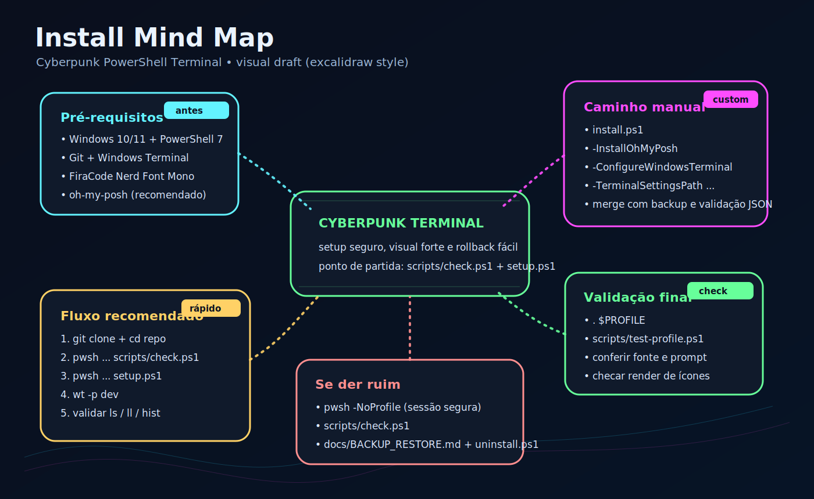

# Cyberpunk PowerShell Terminal

Idioma: Português do Brasil | [English](README.en.md)


Um kit portátil para Windows Terminal + PowerShell 7 com visual cyberpunk,
busca rápida no histórico, prompt com oh-my-posh e um renderer customizado de
`ls` com ícones Nerd Font e cores neon RGB.

Este projeto nasceu de um setup real de uso diário e foi organizado para virar
um pacote reproduzível: qualquer pessoa pode clonar, instalar, estudar,
personalizar e contribuir sem depender dos caminhos da minha máquina.

[](https://github.com/bieltrue95/cyberpunk-pwsh-terminal/actions/workflows/ci.yml)


## Comece Aqui

Se você quer só instalar sem estudar tudo agora, use o setup guiado:

```powershell
git clone git@github.com:bieltrue95/cyberpunk-pwsh-terminal.git
cd cyberpunk-pwsh-terminal
pwsh -NoLogo -NoProfile -File .\scripts\check.ps1
pwsh -NoLogo -NoProfile -ExecutionPolicy Bypass -File .\setup.ps1
wt -p dev
```

Sem chave SSH no GitHub? Use HTTPS:

```powershell
git clone https://github.com/bieltrue95/cyberpunk-pwsh-terminal.git
```

Guia para iniciantes: [docs/GETTING_STARTED.md](docs/GETTING_STARTED.md).
Quer contribuir? Veja o [ROADMAP.md](ROADMAP.md).

## Se Der Ruim

Abra uma sessão sem carregar profile e rode o diagnóstico:

```powershell
pwsh -NoLogo -NoProfile
cd cyberpunk-pwsh-terminal
.\scripts\check.ps1
```

Backups e comandos de restauração ficam documentados em
[docs/BACKUP_RESTORE.md](docs/BACKUP_RESTORE.md).

## Galeria

| Listagem com ícones | Histórico e busca |
| --- | --- |
|  |  |

| Regras por dados | Instalação segura |
| --- | --- |
|  |  |

| Começo rápido | Modo emergência |
| --- | --- |
|  |  |

| Mind map visual de instalação | |
| --- | --- |
|  | |

As imagens atuais são SVGs versionados no próprio repositório. Isso garante que
o GitHub renderize a documentação sem depender de hospedagem externa. Capturas
PNG reais do Windows Terminal podem ser adicionadas depois em `screenshots/`.

## O Que Este Projeto Entrega

- Profile de PowerShell 7 focado em fluxo de desenvolvimento.
- Histórico persistente com busca por prefixo usando `UpArrow` e `DownArrow`.
- Helpers `hist` e `hfind` para consultar comandos salvos.
- Renderer customizado para `ls`, `dir`, `l` e `ll` com ícones e cores RGB.
- Regras de ícones e cores em `data/cyber-item-rules.psd1`.
- Cobertura ampla para pastas do Windows, pastas de usuário, ferramentas dev,
  cloud, Office, certificados, mídia, arquivos compactados, bancos e linguagens.
- Tema cyberpunk minimalista para oh-my-posh.
- Snippet de perfil do Windows Terminal e esquema de cores `Cyberpunk2026`.
- Setup guiado (`setup.ps1`) para instalação com perguntas e validações.
- Instalador seguro com backup antes de substituir arquivos.
- Merge opcional do Windows Terminal com backup e validação de JSON.
- Diagnóstico e smoke test usados também pelo GitHub Actions.

## Pré-Requisitos

Instale ou verifique estes itens antes de aplicar o profile:

| Requisito | Por que importa | Obrigatório |
| --- | --- | --- |
| Windows 10/11 | Plataforma alvo deste setup. | Sim |
| PowerShell 7 (`pwsh`) | O profile foi feito para PowerShell moderno, não para Windows PowerShell 5.1. | Sim |
| Git | Necessário para clonar e atualizar o repositório. | Sim para instalação via repo |
| Windows Terminal | Necessário para esquema `Cyberpunk2026`, acrylic, abas e ANSI true color. | Recomendado |
| FiraCode Nerd Font Mono | Necessário para renderizar ícones e glyphs do prompt. | Sim para ícones |
| oh-my-posh | Responsável pelo prompt estilizado. | Recomendado |

Verificação rápida:

```powershell
pwsh --version
git --version
wt --version
oh-my-posh --version
```

O profile ainda carrega sem oh-my-posh, mas o prompt estilizado só aparece se o
binário estiver instalado e disponível no `PATH`.

Instalação comum com `winget`:

```powershell
winget install Microsoft.PowerShell
winget install Git.Git
winget install Microsoft.WindowsTerminal
winget install JanDeDobbeleer.OhMyPosh -s winget
```

Instale a fonte `FiraCode Nerd Font Mono` pelo Nerd Fonts e selecione essa fonte
no Windows Terminal. Se os ícones aparecerem como quadrados ou pontos de
interrogação, a fonte está ausente ou o perfil do terminal está usando outra.

## Início Rápido Manual

Clone o repositório:

```powershell
git clone git@github.com:bieltrue95/cyberpunk-pwsh-terminal.git
cd cyberpunk-pwsh-terminal
```

Rode o diagnóstico antes de instalar:

```powershell
pwsh -NoLogo -NoProfile -File .\scripts\check.ps1
```

Instale com o setup guiado:

```powershell
pwsh -NoLogo -NoProfile -ExecutionPolicy Bypass -File .\setup.ps1
```

Ou instale manualmente apenas profile, tema e regras:

```powershell
.\install.ps1
```

Recarregue a sessão atual ou abra uma nova aba do Windows Terminal:

```powershell
. $PROFILE
```

## Modos Opcionais De Instalação

Instalar oh-my-posh com `winget` se ele estiver ausente:

```powershell
.\install.ps1 -InstallOhMyPosh
```

Mesclar automaticamente o perfil e o esquema de cores no Windows Terminal:

```powershell
.\install.ps1 -ConfigureWindowsTerminal
```

Usar um caminho customizado para `settings.json` do Windows Terminal:

```powershell
.\install.ps1 -ConfigureWindowsTerminal -TerminalSettingsPath "C:\path\to\settings.json"
```

O merge do Windows Terminal é opcional. Ele cria backup com timestamp e valida o
JSON antes de escrever qualquer alteração.

## Backups E Restauração

O instalador salva backups ao lado dos arquivos originais.

| Backup | Onde fica | Formato |
| --- | --- | --- |
| Profile antigo | Mesma pasta do `$PROFILE` | `Microsoft.PowerShell_profile.ps1.bak-yyyyMMdd-HHmmss` |
| Uninstall | Mesma pasta do `$PROFILE` | `Microsoft.PowerShell_profile.ps1.backup-before-uninstall-yyyyMMdd-HHmmss` |
| Windows Terminal | Mesma pasta do `settings.json` | `settings.json.bak-yyyyMMdd-HHmmss` |

Arquivos instalados normalmente ficam em:

```text
C:\Users\<voce>\Documents\PowerShell\Microsoft.PowerShell_profile.ps1
C:\Users\<voce>\Documents\PowerShell\themes\cyberpunk-clean.omp.json
C:\Users\<voce>\Documents\PowerShell\data\cyber-item-rules.psd1
```

Para o guia completo de backup, listagem e restauração, veja
[docs/BACKUP_RESTORE.md](docs/BACKUP_RESTORE.md).

## Comandos Do Dia A Dia

```powershell
ls
ll
hist -Last 20
hist -Search git
hfind docker
ccurl --version
```

## Como O Motor De Ícones Funciona

O renderer foi separado intencionalmente em lógica e dados.

```text
data\cyber-item-rules.psd1                 # regras de ícones e cores
profile\Microsoft.PowerShell_profile.ps1   # motor de regras e renderer
```

O profile carrega `data/cyber-item-rules.psd1` e resolve cada item nesta ordem:

1. Fallback para links.
2. Regras regex para diretórios.
3. Regras regex para nomes de arquivos.
4. Mapas por extensão.
5. Fallback padrão para pasta ou arquivo.

Isso facilita contribuições: a maioria dos pedidos de novos ícones muda apenas o
arquivo de dados, não o renderer em PowerShell.

## Personalizar Ícones E Cores

Edite:

```text
data\cyber-item-rules.psd1
```

Exemplo:

```powershell
ExtensionIcons = @{
    '.ps1' = '󰨊'
    '.json' = ''
}

ExtensionColors = @{
    '.ps1' = '#63F3FF'
    '.json' = '#FFD166'
}
```

Seções principais:

- `DirectoryIconRules`: regras regex para ícones de pastas.
- `FileIconRules`: regras regex para ícones por nome de arquivo.
- `ExtensionIcons`: mapa de extensão para ícone.
- `DirectoryColorRules`: regras regex para cores de pastas.
- `FileColorRules`: regras regex para cores por nome de arquivo.
- `ExtensionColors`: mapa de extensão para cor.

Mantenha o arquivo em UTF-8, porque os glyphs Nerd Font ficam gravados direto no
arquivo.

## Configuração Do Windows Terminal

Referência manual:

```text
terminal\windows-terminal-snippet.json
```

O snippet contém:

- Perfil `dev`.
- Esquema de cores `Cyberpunk2026`.
- Fonte `FiraCode Nerd Font Mono`.
- Acrylic, opacidade e estilo da aba.

Setup automático:

```powershell
.\scripts\merge-windows-terminal.ps1
```

## Testar Sem Instalar

```powershell
pwsh -NoLogo -NoProfile -File .\scripts\test-profile.ps1
```

Esse teste carrega o profile direto do repositório, cria uma pasta temporária
com arquivos de exemplo, renderiza a listagem customizada e remove a pasta.

## Estrutura Do Projeto

```text
cyberpunk-pwsh-terminal/
├─ data/
│  └─ cyber-item-rules.psd1
├─ docs/
│  ├─ en/
│  ├─ ARCHITECTURE.md
│  ├─ CYBERPUNK_TERMINAL_SETUP.md
│  ├─ INSTALL.md
│  ├─ SCREENSHOTS.md
│  └─ TROUBLESHOOTING.md
├─ profile/
│  └─ Microsoft.PowerShell_profile.ps1
├─ screenshots/
├─ scripts/
│  ├─ check.ps1
│  ├─ merge-windows-terminal.ps1
│  └─ test-profile.ps1
├─ terminal/
├─ themes/
├─ install.ps1
└─ uninstall.ps1
```

## Solução De Problemas

Se os ícones aparecerem como quadrados, instale/selecione `FiraCode Nerd Font
Mono` no Windows Terminal e no VS Code.

Se o prompt não estiver estilizado, verifique se `oh-my-posh` está instalado:

```powershell
oh-my-posh --version
```

Se `ls` funciona, mas as cores/ícones não estão como você quer, edite:

```text
data\cyber-item-rules.psd1
```

Mais correções estão em [docs/TROUBLESHOOTING.md](docs/TROUBLESHOOTING.md).

## Documentação

- [Instalação](docs/INSTALL.md)
- [Comece aqui](docs/GETTING_STARTED.md)
- [Backup e restauração](docs/BACKUP_RESTORE.md)
- [Arquitetura](docs/ARCHITECTURE.md)
- [Screenshots](docs/SCREENSHOTS.md)
- [Solução de problemas](docs/TROUBLESHOOTING.md)
- [Notas do setup do terminal](docs/CYBERPUNK_TERMINAL_SETUP.md)
- [Como contribuir](CONTRIBUTING.md)
- [Changelog](CHANGELOG.md)
- [English README](README.en.md)

## Licenças De Dependências E Assets

- [Inventário de terceiros](THIRD_PARTY_NOTICES.md)
- [Atribuição de assets visuais](ASSET_ATTRIBUTION.md)
- [Política de marcas](TRADEMARKS.md)
- [Política de compliance jurídico](LEGAL_COMPLIANCE.md)
- [Canal de segurança e vazamentos](SECURITY.md)

Este projeto é compatível com ferramentas e produtos de terceiros citados na
documentação, sem afiliação ou endosso implícito.

## Roadmap

- Adicionar screenshots PNG reais do Windows Terminal.
- Adicionar temas extras: minimal, heavy neon e high-contrast.
- Adicionar testes Pester para resolução de ícones e cores.
- Gerar uma galeria de regras a partir de `data/cyber-item-rules.psd1`.
- Criar comando seguro para atualizar instalações existentes.

## Notas

- Este projeto não depende de Terminal-Icons para renderizar `ls`.
- O renderer é autocontido para evitar problemas de cache de módulo.
- O terminal só consegue inferir ícones pelo nome/extensão de arquivos e pastas;
  o objetivo é cobertura prática, não mapear perfeitamente todos os glyphs Nerd Font.
- Este repositório não fornece aconselhamento jurídico; uso por conta e risco.

## Licença

MIT
