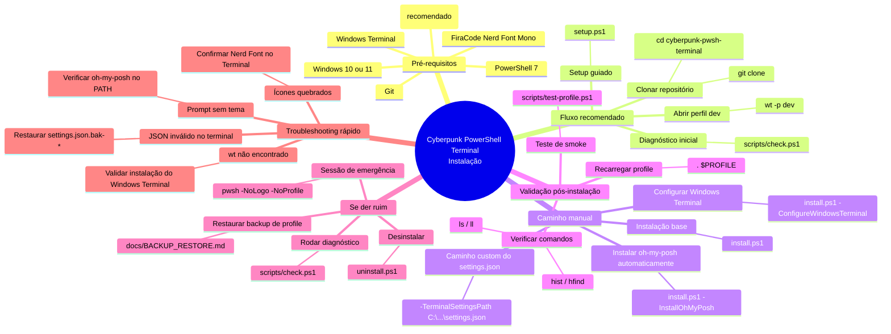

# Mind Map De Instalação

```mermaid
mindmap
  root((Cyberpunk PowerShell Terminal<br/>Instalação))
    Pré-requisitos
      Windows 10 ou 11
      PowerShell 7
      Git
      Windows Terminal
      FiraCode Nerd Font Mono
      oh-my-posh (recomendado)
    Fluxo recomendado
      Clonar repositório
        git clone
        cd cyberpunk-pwsh-terminal
      Diagnóstico inicial
        scripts/check.ps1
      Setup guiado
        setup.ps1
      Abrir perfil dev
        wt -p dev
    Caminho manual
      Instalação base
        install.ps1
      Instalar oh-my-posh automaticamente
        install.ps1 -InstallOhMyPosh
      Configurar Windows Terminal
        install.ps1 -ConfigureWindowsTerminal
      Caminho custom do settings.json
        -TerminalSettingsPath C:\\...\\settings.json
    Validação pós-instalação
      Recarregar profile
        . $PROFILE
      Verificar comandos
        ls / ll
        hist / hfind
      Teste de smoke
        scripts/test-profile.ps1
    Se der ruim
      Sessão de emergência
        pwsh -NoLogo -NoProfile
      Rodar diagnóstico
        scripts/check.ps1
      Restaurar backup de profile
        docs/BACKUP_RESTORE.md
      Desinstalar
        uninstall.ps1
    Troubleshooting rápido
      Ícones quebrados
        Confirmar Nerd Font no Terminal
      Prompt sem tema
        Verificar oh-my-posh no PATH
      wt não encontrado
        Validar instalação do Windows Terminal
      JSON inválido no terminal
        Restaurar settings.json.bak-*
```

